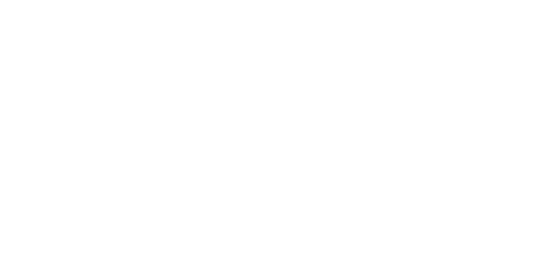
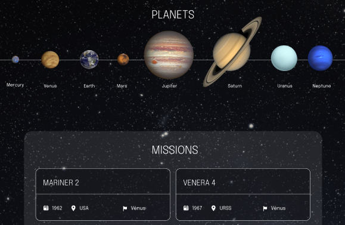

<p align="center">
  
  <br>
  <br>
  <hr />
</p>

<p align="center">
  A project developed at Trybe's Front-End Module
</p>

<br>

<p align="center">


    

</p>

## 📋 About
At this project you can view planets and space mission data. 


<em>website mockup design</em>

## 💻 Technology
- React

## ✨ Features 
- See planets
- See space missions

## 🧠 What I learned
At this project, I learned the basic of React. It was one of my first React projects 

## 📦 Running
> use Node version 14

```bash
npm i
```
```bash 
npm start
```
